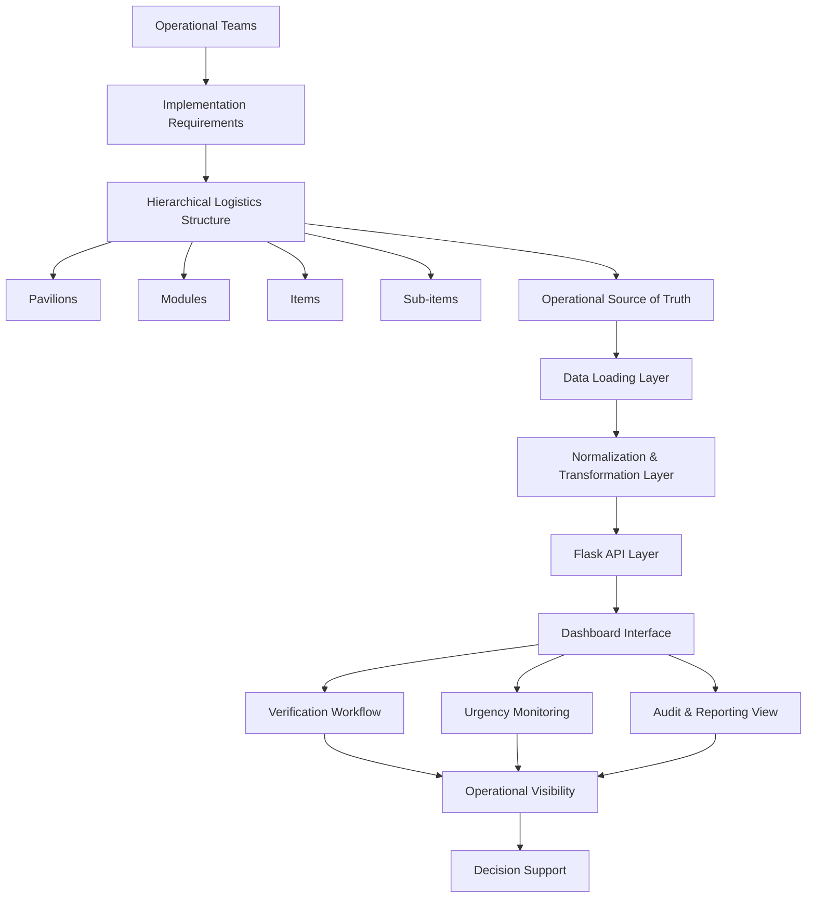

# Architecture Diagram

This diagram represents the public, NDA-safe architecture of the logistics information system and its relationship to the original operational workflow.

```mermaid
flowchart TD
    A[Operational Teams] --> B[Implementation Requirements]
    B --> C[Hierarchical Logistics Structure]
    C --> C1[Pavilions]
    C --> C2[Modules]
    C --> C3[Items]
    C --> C4[Sub-items]

    C --> D[Operational Source of Truth]
    D --> E[Data Loading Layer]
    E --> F[Normalization & Transformation Layer]
    F --> G[Flask API Layer]

    G --> H[Dashboard Interface]
    H --> I[Verification Workflow]
    H --> J[Urgency Monitoring]
    H --> K[Audit & Reporting View]

    I --> L[Operational Visibility]
    J --> L
    K --> L

    L --> M[Decision Support]
```
